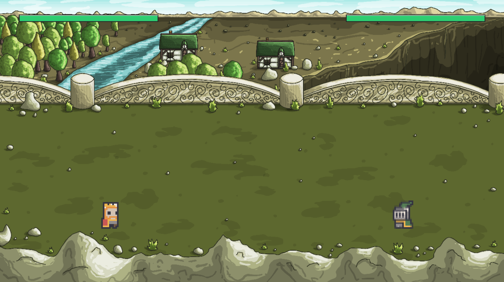

# Nogame 
Nogame is a hobby project dedicated to exploring the mechanism of 2D fighting games.
Inspired by classics like Tekken and Street Fighter, this project focuses on translating high-stakes combat logic into a minimalist pixel art aesthetic.

## Getting Started
### Prerequisites
* Python 3.8+
* Pygame CE (Community Edition)

### Installation
1. Clone the repository:
   `git clone https://github.com/asinbase/nogame.git`
2. Install dependencies:
   `pip install pygame`
3. Run the game:
   `python main.py`

## Project Structure
* `src/entities.py`: Core physics, animation, and combat logic for fighters.
* `src/ui.py`: Dynamic rendering for health bars and HUD elements.
* `src/settings.py`: Global constants (Gravity, Resolution, Floor height).
* `assets/`: Spritesheets and background layers.

  

